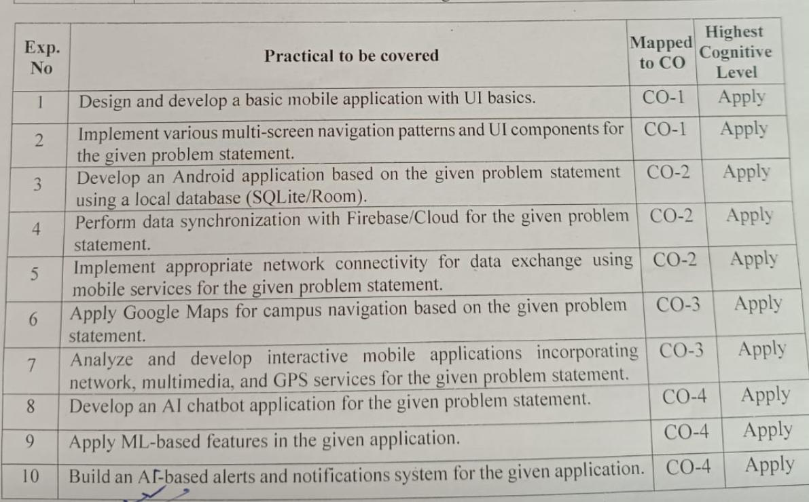
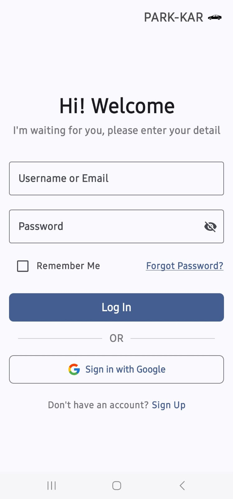
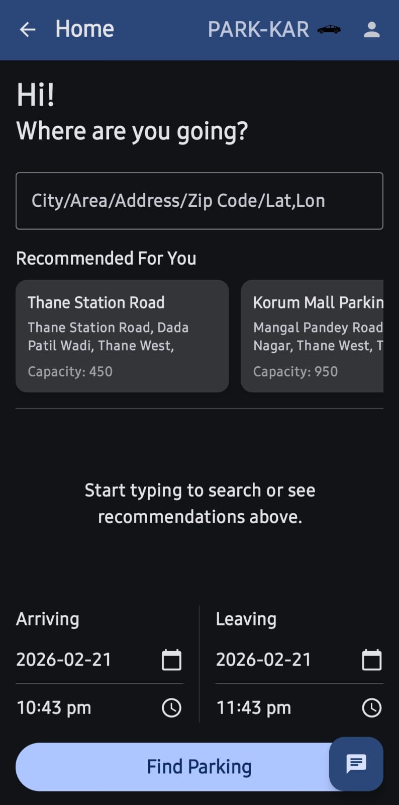
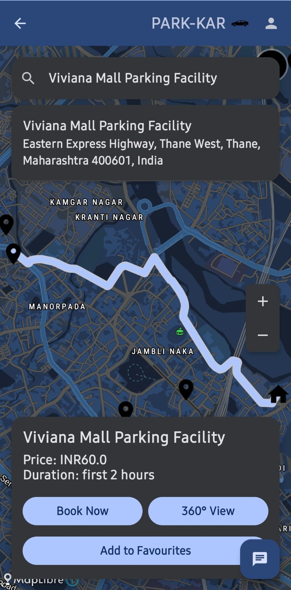
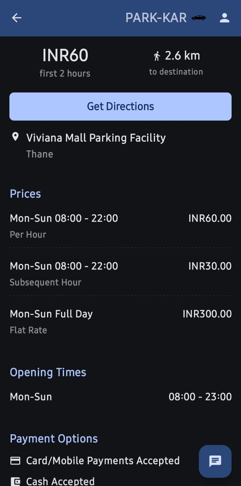
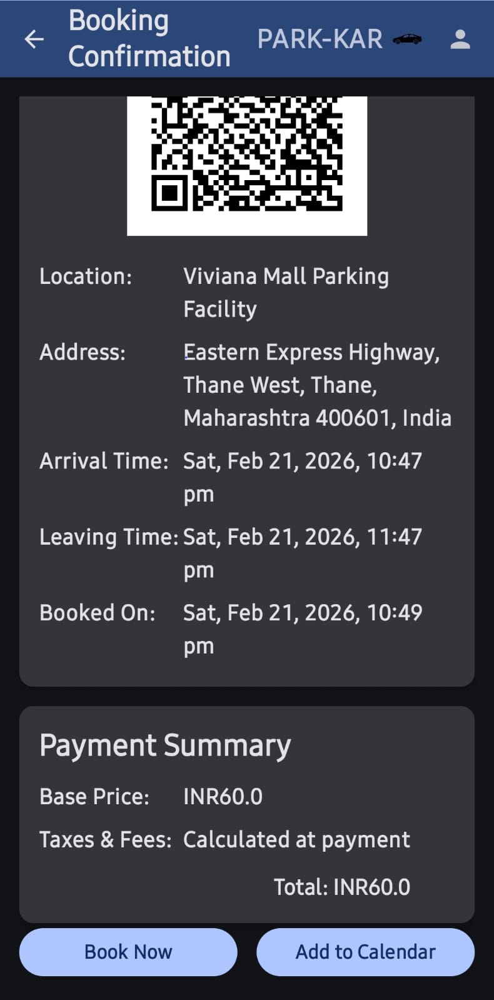
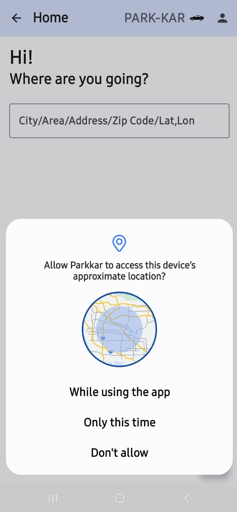
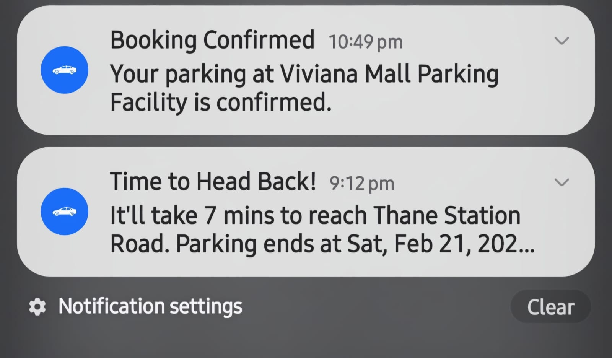
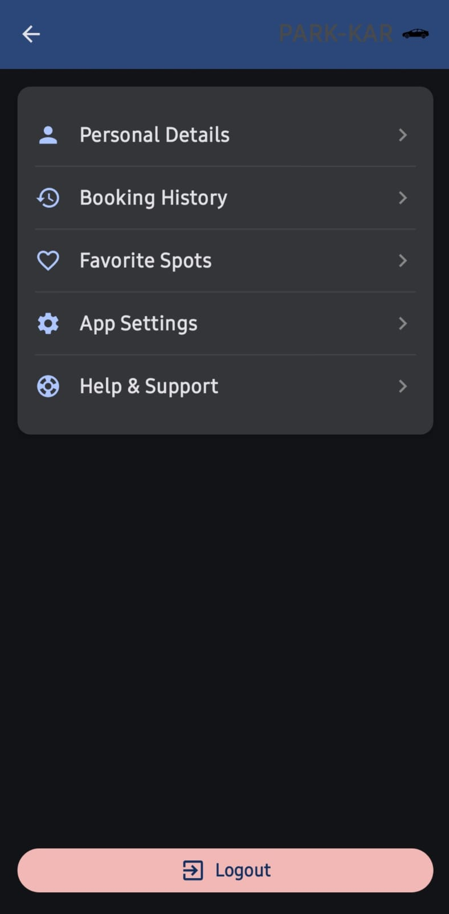

# 🅿️ Parkkar — Smart Parking Finder

**Parkkar** is a **college-level** native Android application built with **Kotlin** and **Jetpack Compose**, developed as part of our **lab syllabus experiments** for educational and demonstration purposes. It helps users discover, compare, and book parking spots across major Indian cities — combining real-time map visualization, an AI-powered chatbot, a smart recommendation engine, and QR-code booking in a modern Material Design 3 interface with dark mode support.

---

## 📋 Table of Contents

- [Lab Experiment Requirements](#lab-experiment-requirements)
- [Features](#features)
- [Screenshots & App Flow](#screenshots--app-flow)
- [Tech Stack](#tech-stack)
- [Architecture Overview](#architecture-overview)
- [Project Structure](#project-structure)
- [Prerequisites](#prerequisites)
- [Setup & Installation](#setup--installation)
- [City Data Coverage](#city-data-coverage)
- [Key Modules Deep Dive](#key-modules-deep-dive)
- [Build & Run](#build--run)
- [Testing](#testing)
- [Known Limitations & Scope for Improvement](#known-limitations--scope-for-improvement)
- [Future Enhancements](#future-enhancements)
- [Support](#support)
- [Disclaimer](#disclaimer)

---

## <a id="lab-experiment-requirements"></a> 🧪 Lab Experiment Requirements

This project was developed to fulfill the following practicals from our lab syllabus:

<p align="center">
  
</p>

---

## <a id="features"></a> ✨ Features

### Core Functionality
- **🗺️ Interactive Map** — Full-screen dark-themed MapLibre GL map powered by MapTiler, with custom parking markers and tap-to-view details.
- **🔍 Parking Search** — Search by location name, address, or city with real-time filtering across 5 Indian cities.
- **📊 Parking Comparison** — View capacity (2-wheeler & 4-wheeler), coverage type (covered/multi-level/uncovered), pricing tiers, and opening hours.
- **🧠 Smart Recommendations** — AI-driven suggestions using a composite scoring algorithm (proximity via Haversine formula + time-of-day patterns + capacity weighting).
- **🛣️ Route Navigation** — Turn-by-turn route polylines from user location to parking spot via OSRM Directions API.

### AI & Automation
- **🤖 Gemini AI Chatbot** — Context-aware parking assistant powered by Google's Gemini 2.5 Flash model. The chatbot receives the full parking dataset as context, enabling natural-language queries about availability, pricing, and location.
- **🔔 Smart Notifications** — WorkManager-based "Time to Leave" alerts that fire before a parking booking expires.
- **📱 QR Code Booking** — ZXing-generated QR codes for each booking confirmation, encoding spot ID and time range.

### User Management
- **🔐 Dual Authentication** — Email/password login with SHA-256 hashing + Google Sign-In via Firebase Auth.
- **👤 User Profiles** — View and edit personal details (name, username, email, phone).
- **📖 Booking History** — Full booking history stored in local SQLite database.
- **❤️ Favorite Spots** — Save and manage preferred parking locations.
- **⚙️ Settings** — Dark/light theme toggle and notification preferences, persisted via Jetpack DataStore.
- **📅 Calendar Integration** — Add bookings directly to device calendar via Calendar Intent.

---

## <a id="screenshots--app-flow"></a> 📸 Screenshots & App Flow

<table>
  <tr>
    <td align="center" width="25%">
      
      <br/><b>🔐 Authentication</b>
    </td>
    <td align="center" width="25%">
      
      <br/><b>🔍 Parking Search</b>
    </td>
    <td align="center" width="25%">
      
      <br/><b>🗺️ Map View</b>
    </td>
    <td align="center" width="25%">
      
      <br/><b>📊 Parking Details</b>
    </td>
  </tr>
  <tr>
    <td align="center" width="25%">
      
      <br/><b>🎫 Booking & QR Code</b>
    </td>
    <td align="center" width="25%">
      
      <br/><b>📍 Location & Directions</b>
    </td>
    <td align="center" width="25%">
      
      <br/><b>🔔 Notifications</b>
    </td>
    <td align="center" width="25%">
      
      <br/><b>👤 User Profile</b>
    </td>
  </tr>
</table>

```
App Flow:  Login → Home (Search + Recommendations) → Parking Results → Map View → Booking Confirmation (QR)
                                                                          │
           Profile → Personal Details / Booking History / Favorites       ├── Route Navigation
                     / Settings / Help & Support                          └── AI Chatbot
```

---

## <a id="tech-stack"></a> 🛠️ Tech Stack

| Layer | Technology | Version |
|-------|-----------|---------|
| **Language** | Kotlin | Latest stable |
| **UI Framework** | Jetpack Compose + Material 3 | BOM-managed |
| **Maps** | MapLibre GL Native | 11.5.0 |
| **Map Tiles** | MapTiler (Streets Dark v4) | API-based |
| **Authentication** | Firebase Auth + Google Sign-In | BOM-managed |
| **AI/ML** | Google Generative AI (Gemini) | 0.9.0 |
| **Networking** | Ktor Client (OkHttp engine) | 2.3.10 |
| **Routing** | OSRM (Open Source Routing Machine) | Public API |
| **QR Codes** | ZXing Core | 3.5.3 |
| **Local Storage** | SQLite (SQLiteOpenHelper) | Built-in |
| **Preferences** | Jetpack DataStore | 1.1.7 |
| **Background Tasks** | WorkManager | 2.9.0 |
| **Serialization** | Kotlinx Serialization + Gson | Latest |
| **Build System** | Gradle KTS | Catalog-managed |
| **Min SDK** | Android 8.0 (API 26) | — |
| **Target SDK** | Android 16 (API 36) | — |

---

## <a id="architecture-overview"></a> 🏗️ Architecture Overview

The app follows a **multi-Activity architecture** with Jetpack Compose for the UI layer and ViewModels for state management. Each major feature is encapsulated in its own Activity + Composable screen pair.

```
┌──────────────────────────────────────────────────────────┐
│                      UI Layer                            │
│  Activities (13) → Composable Screens → ViewModels (4)   │
│  LoginActivity, HomeActivity, MapActivity, ChatbotAct... │
├──────────────────────────────────────────────────────────┤
│                   Domain Layer                           │
│  RecommendationEngine (Haversine + Scoring)              │
├──────────────────────────────────────────────────────────┤
│                    Data Layer                            │
│  ParkingRepository (JSON parsing + caching)              │
│  DatabaseHelper (SQLite — users, bookings, favorites)    │
│  UserPreferencesRepository (DataStore — theme, notifs)   │
├──────────────────────────────────────────────────────────┤
│                  Network Layer                           │
│  DirectionsService (Ktor/OkHttp → OSRM API)             │
│  Gemini AI Client (GenerativeModel)                      │
├──────────────────────────────────────────────────────────┤
│                 Infrastructure                           │
│  Firebase Auth · MapLibre · WorkManager · ZXing          │
└──────────────────────────────────────────────────────────┘
```

### Data Flow

1. **Parking Data** — Loaded from bundled JSON assets → parsed by `ParkingRepository` (singleton with in-memory cache) → served to ViewModels.
2. **User Data** — Managed by `DatabaseHelper` (SQLite) for persistence and `UserPreferencesRepository` (DataStore) for settings.
3. **Map & Routing** — MapLibre renders tiles from MapTiler; `DirectionsService` fetches GeoJSON routes from OSRM.
4. **AI Chatbot** — `ChatbotViewModel` sends the full parking dataset as context to Gemini, then streams chat responses.

---

## <a id="project-structure"></a> 📁 Project Structure

```
Parkkar/
├── app/
│   ├── build.gradle.kts              # App-level dependencies & build config
│   ├── google-services.json          # Firebase configuration
│   ├── proguard-rules.pro            # ProGuard rules
│   └── src/main/
│       ├── AndroidManifest.xml        # 13 Activities declared
│       ├── assets/                    # Parking data JSON files
│       │   ├── bengaluru_parking.json
│       │   ├── mumbai_parking.json
│       │   ├── panaji_parking.json
│       │   ├── surat_parking.json
│       │   └── thane_sample.json
│       ├── java/com/example/parkkar/
│       │   ├── MainApplication.kt                 # App-level state (theme)
│       │   │
│       │   ├── LoginActivity.kt                   # Email/password + Google Sign-In
│       │   ├── SignUpActivity.kt                  # User registration
│       │   ├── ForgotPasswordActivity.kt          # Password reset
│       │   ├── HomeActivity.kt                    # Dashboard with search + recommendations
│       │   ├── MapActivity.kt                     # Interactive map with markers & routes
│       │   ├── ParkingResultsActivity.kt          # Search results list
│       │   ├── BookingConfirmationActivity.kt     # QR code ticket + calendar integration
│       │   ├── ChatbotActivity.kt                 # Gemini AI chatbot interface
│       │   ├── ProfileActivity.kt                 # User profile hub
│       │   ├── PersonalDetailsActivity.kt         # Edit personal info
│       │   ├── BookingHistoryActivity.kt          # Past bookings
│       │   ├── FavoriteSpotsActivity.kt           # Saved parking locations
│       │   ├── SettingsActivity.kt                # Theme & notification toggles
│       │   └── HelpAndSupportActivity.kt          # FAQ & support
│       │   │
│       │   ├── data/
│       │   │   ├── DatabaseHelper.kt              # SQLite (users, bookings, favorites, logs)
│       │   │   ├── UserPreferencesRepository.kt   # DataStore wrapper (singleton)
│       │   │   └── model/
│       │   │       └── PriceInfo.kt               # Price data model
│       │   │
│       │   ├── model/
│       │   │   ├── ParkingLocation.kt             # Core domain model
│       │   │   ├── PriceInfo.kt                   # Pricing tiers
│       │   │   ├── OpeningTimeInfo.kt             # Operating hours
│       │   │   ├── Booking.kt                     # Booking record
│       │   │   ├── FavoriteSpot.kt                # Favorite entry
│       │   │   └── UserDetails.kt                 # User profile data
│       │   │
│       │   ├── network/
│       │   │   └── DirectionsService.kt           # OSRM routing via Ktor/OkHttp
│       │   │
│       │   ├── recommendation/
│       │   │   └── RecommendationEngine.kt        # Proximity + time + capacity scoring
│       │   │
│       │   ├── repository/
│       │   │   └── ParkingRepository.kt           # JSON parsing + in-memory cache
│       │   │
│       │   ├── ui/
│       │   │   ├── chatbot/
│       │   │   │   ├── ChatbotViewModel.kt        # Gemini integration + chat state
│       │   │   │   └── ChatbotViewModelFactory.kt # ViewModel factory
│       │   │   ├── common/
│       │   │   │   └── CommonAppBar.kt            # Reusable top bar
│       │   │   ├── home/
│       │   │   │   └── HomeViewModel.kt           # Home screen state management
│       │   │   ├── map/
│       │   │   │   └── MapViewModel.kt            # Map data + interactions
│       │   │   ├── parkingresults/
│       │   │   │   └── ParkingResultsViewModel.kt # Search results state
│       │   │   └── theme/
│       │   │       ├── Color.kt                   # Light & dark color palette
│       │   │       ├── Theme.kt                   # Material 3 theme config
│       │   │       └── Type.kt                    # Typography definitions
│       │   │
│       │   ├── utils/
│       │   │   ├── Crypto.kt                      # SHA-256 hashing + password validation
│       │   │   ├── MarkerUtils.kt                 # Map marker bitmap generation
│       │   │   └── NotificationHelper.kt          # Notification channel & display
│       │   │
│       │   └── worker/
│       │       └── TimeToLeaveWorker.kt           # WorkManager job for departure alerts
│       │
│       └── res/
│           ├── drawable/                          # Icons, logo, markers, gradients
│           ├── layout/                            # Legacy XML layouts (if any)
│           ├── mipmap-*/                           # Adaptive launcher icons
│           ├── values/                            # strings.xml, colors.xml, themes.xml
│           └── xml/                               # Backup & data extraction rules
│
├── build.gradle.kts                   # Root build file (plugins)
├── settings.gradle.kts                # Project settings
├── gradle.properties                  # JVM & AndroidX config
└── gradle/                            # Gradle wrapper + version catalog
```

---

## <a id="prerequisites"></a> ✅ Prerequisites

- **Android Studio** Ladybug (2024.2.1) or newer
- **JDK 11** or higher
- **Android SDK** with API 36 installed
- **Firebase Project** with Authentication enabled
- **MapTiler Account** for map tile API key
- **Google AI Studio** account for Gemini API key

---

## <a id="setup--installation"></a> ⚙️ Setup & Installation

### 1. Clone the Repository

```bash
git clone https://github.com/<your-username>/Parkkar.git
cd Parkkar
```

### 2. Firebase Setup

1. Go to the [Firebase Console](https://console.firebase.google.com/).
2. Create a new project or use an existing one.
3. Add an Android app with package name: `com.example.parkkar`.
4. Download `google-services.json` and place it in `app/`.
5. Enable **Email/Password** and **Google Sign-In** under Authentication → Sign-in method.

### 3. Configure API Keys

Create or edit `local.properties` in the project root:

```properties
# MapTiler API Key — get from https://cloud.maptiler.com/account/keys/
MAPTILER_API_KEY=your_maptiler_api_key_here

# Gemini API Key — get from https://aistudio.google.com/app/apikey
GEMINI_API_KEY=your_gemini_api_key_here
```

> ⚠️ **Important:** `local.properties` is gitignored by default. Never commit API keys to version control.

### 4. Google Sign-In Setup

The `default_web_client_id` is configured in `res/values/strings.xml`. Replace it with your Firebase project's Web Client ID from:
**Firebase Console → Authentication → Sign-in method → Google → Web SDK configuration → Web client ID**.

### 5. Sync & Build

Open the project in Android Studio and let Gradle sync. Resolve any SDK installation prompts.

---

## <a id="city-data-coverage"></a> 🏙️ City Data Coverage

The app ships with pre-bundled parking data for **5 Indian cities**:

| City | Data File | Format |
|------|-----------|--------|
| **Mumbai** | `mumbai_parking.json` (141 KB) | GeoJSON-like (features array) |
| **Bengaluru** | `bengaluru_parking.json` (35 KB) | Standard nested JSON |
| **Surat** | `surat_parking.json` (36 KB) | Standard nested JSON |
| **Panaji** | `panaji_parking.json` (35 KB) | Standard nested JSON |
| **Thane** | `thane_sample.json` (31 KB) | Standard nested JSON |

Each parking location can include: name, address, lat/lng coordinates, 2-wheeler/4-wheeler capacity, coverage type, pricing tiers, and opening hours.

---

## <a id="key-modules-deep-dive"></a> 🔬 Key Modules Deep Dive

### Recommendation Engine (`RecommendationEngine.kt`)

Uses a **weighted multi-factor scoring** algorithm:

| Factor | Weight | Method |
|--------|--------|--------|
| Proximity | 50% | Haversine distance formula → inverse normalized score |
| Time of Day | 30% | Boosts business areas on weekday mornings, malls on evenings/weekends |
| Capacity | 20% | Total capacity normalized to 500 max |

Returns the **top 5** scored parking locations.

### Parking Repository (`ParkingRepository.kt`)

- **Singleton** object with lazy-loaded, in-memory cached data.
- Parses two distinct JSON formats:
  - **Mumbai format** — GeoJSON with nested `features` arrays (handles both flat and nested feature elements).
  - **Standard format** — `parking_data.parking_location[]` structure used by Thane, Surat, Panaji, and Bengaluru.
- Uses **Kotlinx Serialization** with `ignoreUnknownKeys` and `isLenient` parsing.

### AI Chatbot (`ChatbotViewModel.kt`)

- Initializes a **Gemini 2.5 Flash** `GenerativeModel` with the entire parking dataset serialized as the system prompt.
- Supports contextual queries — if launched from a specific parking spot, that spot's details are appended to context.
- Chat sessions are stateful within the ViewModel lifecycle.

### Database Schema (`DatabaseHelper.kt`)

| Table | Purpose | Key Columns |
|-------|---------|-------------|
| `users` | User registration | id, email, phone, full_name, username, password_hash |
| `bookings` | Booking records | id, user_id, parking_spot_id, spot_name, arrival_time, leaving_time |
| `favorites` | Saved spots | id, user_id, parking_spot_id, spot_name, spot_address |
| `activity_log` | Audit trail | id, user_id, activity, timestamp |

Passwords are hashed with **SHA-256** before storage.

### Directions Service (`DirectionsService.kt`)

- Uses **Ktor HTTP Client** with OkHttp engine (chosen over CIO to avoid TLS handshake issues).
- Queries the **OSRM public API** (`router.project-osrm.org`) for driving directions.
- Returns GeoJSON geometry for polyline rendering on the map.

---

## <a id="build--run"></a> 🚀 Build & Run

```bash
# Debug build
./gradlew assembleDebug

# Install on connected device
./gradlew installDebug

# Run from Android Studio
# Click ▶ Run or Shift+F10
```

The app launches on `LoginActivity` as the entry point.

---

## <a id="testing"></a> 🧪 Testing

```bash
# Unit tests
./gradlew test

# Instrumentation tests (requires connected device/emulator)
./gradlew connectedAndroidTest
```

The project includes test infrastructure with JUnit, AndroidX Test, Espresso, and Compose UI Testing dependencies.

---

## <a id="known-limitations--scope-for-improvement"></a> ⚠️ Known Limitations & Scope for Improvement

### Architecture
- **Multi-Activity pattern** — The app uses 13 separate Activities instead of Single-Activity architecture with Jetpack Navigation. Migrating to Navigation Compose would reduce memory overhead and improve transition animations.
- **No dependency injection** — Manual singleton creation (`ParkingRepository`, `UserPreferencesRepository`) instead of Hilt/Dagger. This makes testing harder and creates tight coupling.
- **ViewModel coupling** — Some ViewModels (e.g., `ChatbotViewModel`) directly access repositories, bypassing proper use-case abstraction.

### Data Layer
- **No remote backend** — All parking data is bundled as static JSON assets. A live API would enable real-time availability, dynamic pricing, and multi-city scalability.
- **SQLite over Room** — Uses raw `SQLiteOpenHelper` instead of Room, missing compile-time query verification, coroutine-native DAOs, and migration support.
- **Duplicate `PriceInfo` model** — Exists in both `data.model` and `model` packages, which could cause import ambiguity.

### Security
- **SHA-256 for passwords** — While better than plaintext, SHA-256 is not recommended for password hashing. Use **bcrypt**, **scrypt**, or **Argon2** via a library for proper security.
- **Client-side only auth** — When not using Firebase Google Sign-In, credentials are stored in local SQLite. No server-side validation exists.
- **Gemini API key in BuildConfig** — While loaded from `local.properties`, the key is compiled into the APK and can be extracted via reverse engineering. Use a backend proxy for production.

### UX & Performance
- **No pagination** — Parking results load all data at once. For large datasets, RecyclerView-based lazy loading or Paging 3 would be beneficial.
- **Hardcoded recommendation logic** — Time-of-day scoring references specific location names ("Korum Mall", "Viviana Mall"), making it non-generalizable.
- **Fixed travel time** — `TimeToLeaveWorker` uses a hardcoded 7-minute travel estimate instead of real-time calculated ETA.
- **No offline caching** — Map tiles require internet. Implementing offline tile caching would improve the user experience in low-connectivity areas.

### Code Quality
- **Lacking test coverage** — No custom unit or UI tests are written yet; only the default template test files exist.
- **Unused layouts** — The `res/layout/` directory exists but Compose handles all UI, suggesting incomplete migration artifacts.

---

## <a id="future-enhancements"></a> 🚀 Future Enhancements

The following features are feasible next steps to elevate Parkkar beyond its current scope:

| # | Enhancement | Description |
|:-:|-------------|-------------|
| 1 | **Real-Time Availability** | Integrate IoT sensor data or a live backend API to show real-time slot occupancy instead of static JSON data. |
| 2 | **In-App Payment Gateway** | Add Razorpay/UPI payment integration for seamless booking and pre-payment of parking fees. |
| 3 | **Single-Activity + Navigation Compose** | Migrate from multi-Activity to Jetpack Navigation for smoother transitions and lower memory usage. |
| 4 | **Room Database Migration** | Replace raw `SQLiteOpenHelper` with Room for compile-time query safety, coroutine-native DAOs, and versioned migrations. |
| 5 | **Hilt Dependency Injection** | Introduce Hilt to decouple ViewModels from repositories and enable easier unit testing. |
| 6 | **Offline Map Caching** | Cache MapTiler tiles locally so the map remains usable in low-connectivity areas. |
| 7 | **Multi-Language Support** | Add `strings.xml` translations for Hindi, Marathi, Gujarati, and Kannada to serve users across covered cities. |
| 8 | **Live ETA Notifications** | Replace the hardcoded 7-min travel time with real-time ETA from OSRM, dynamically scheduling "Time to Leave" alerts. |
| 9 | **User Reviews & Ratings** | Allow users to rate and review parking spots, stored in Firebase Firestore for community-driven data. |
| 10 | **Admin Dashboard** | Build a companion web panel for parking lot owners to manage spots, pricing, and view analytics. |

---

## <a id="support"></a> 📬 Support

Have questions, suggestions, or want to contribute? Feel free to reach out:

| Platform | Link |
|----------|------|
| **GitHub** | [omi3107](https://github.com/omi3107) |
| **Email** | [omkardesai3107@gmail.com](mailto:omkardesai3107@gmail.com) |
| **LinkedIn** | [Omkar Desai](https://www.linkedin.com/in/omkar-desai-726037333/) |

> 💡 **Found a bug?** Open an [issue](https://github.com/omi3107/Smart_Parking_app/issues) on the repository.

---

## <a id="disclaimer"></a> 📄 Disclaimer

This project is a **college-level academic project**, developed by considering the experiments prescribed in our **lab syllabus**. It is intended **solely for educational and demonstration purposes**. Please add an appropriate license before open-sourcing.

---

<p align="center">
  Built with ❤️ using Kotlin, Jetpack Compose & Material 3
</p>
